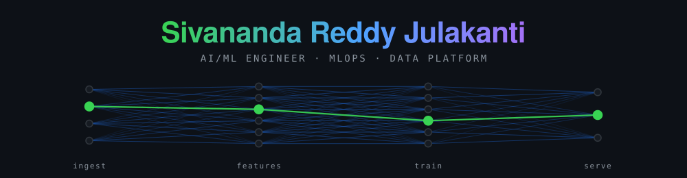

<div align="center">



<br>

[](https://github.com/sivananda1995)
[](https://github.com/sivananda1995?tab=repositories)
[](https://sivananda1995.github.io/portfolio/)
[](https://sivananda1995.github.io/portfolio/)

**I build tools around one question: what does this artefact structurally fail to tell you?**

</div>

---

<table>
<tr>
<td width="20%" align="center"><h3>⏳ 8+</h3><sub>YEARS IN PRODUCTION</sub></td>
<td width="20%" align="center"><h3>📦 8</h3><sub>ENGINEERED REPOS</sub></td>
<td width="20%" align="center"><h3>🧪 1,807</h3><sub>TESTS, ALL PASSING</sub></td>
<td width="20%" align="center"><h3>📐 39</h3><sub>DECISION RECORDS</sub></td>
<td width="20%" align="center"><h3>🏆 2</h3><sub>CLOUD CERTIFICATIONS</sub></td>
</tr>
</table>

> A parity check cannot say which side is wrong. A Terraform plan cannot contain a loss its dependency
> graph has no edge for. A threshold on a small golden set cannot separate a regression from noise. A
> byte that has been sent cannot be recalled. Every repository on this profile supplies what the usual
> artefact cannot, and leads with the number it would rather not publish.

---

## 🧭 The Pivot Point

Three roles, and the shape of the move matters more than the dates.

```
2017 ──────────────► 2020        2022 ──────────► 2024        2024 ──────────► now
  Wells Fargo, Data Engineer      Adobe, ML Engineer            Meta, AI/ML Engineer
  ETL/ELT, Spark, Hadoop,         feature pipelines,            GenAI ranking and
  Snowflake, cloud migration      MLflow, productionising       recommendation, RAG,
  for risk and fraud analytics    models behind FastAPI         real-time inference
        │                               │                              │
        └── moved the data ─────────────┴── then moved the model ──────┴── now moves the decision
```

The pivot is not "data engineer becomes ML engineer". It is that each step kept the previous
discipline instead of replacing it. The MS in Computer Science (2022) is the hinge: pipelines first,
then models on top of pipelines, then generative systems that are only as trustworthy as the pipeline
and the monitoring underneath them. That is why the repositories on this profile are about **the
plumbing of AI**, not about model architectures: skew between training and serving, cost attribution
per prompt version, what a guardrail lets through, what a plan actually destroys.

---

## 🔭 Current Focus

<table>
<tr>
<td width="50%">

**At Meta, now**
- LLM ranking and recommendation with RAG over vector stores
- Real-time inference on Databricks, Spark and Delta Lake
- MLOps with MLflow, Kubeflow and SageMaker: training, versioning, monitoring
- Inference latency work: caching and model optimisation

</td>
<td width="50%">

**In the open, now**
- `llm-guardrail-proxy`: what a guardrail lets through, measured
- `serving-skew-sentinel`: arbitrating training and serving skew
- `mlplatform-iac-forge`: blast radius of a Terraform apply
- All eight repositories re-measure their own README numbers in CI

</td>
</tr>
</table>

---

## 📊 Tech Stack, by Depth Rather Than by List

Levels are self-assessed against one test: could I debug it in production at 3am, or have I only
shipped with it?

| | | |
| --- | --- | --- |
| **Python** | `████████████████████` | Senior. 8 years, every repository on this profile |
| **SQL** | `███████████████████░` | Senior. Warehousing, as-of joins, query tuning |
| **Apache Spark / PySpark** | `██████████████████░░` | Senior. Event-log forensics, skew, shuffle behaviour |
| **MLOps (MLflow, Kubeflow, SageMaker)** | `█████████████████░░░` | Senior. Registry, monitoring, CI for models |
| **Databricks / Delta Lake** | `█████████████████░░░` | Senior. Feature store, transaction log internals |
| **Kafka / streaming** | `████████████████░░░░` | Advanced. Exactly-once, idempotency, watermarks |
| **LLMs / RAG / prompt engineering** | `████████████████░░░░` | Advanced. Retrieval evaluation, guardrails, cost |
| **AWS (S3, Glue, EMR, Lambda)** | `████████████████░░░░` | Advanced. Certified, plus IaC blast-radius work |
| **Airflow / dbt** | `███████████████░░░░░` | Advanced. Production orchestration and models |
| **PyTorch / TensorFlow** | `██████████████░░░░░░` | Intermediate. Fine-tuning and NLP workflows |
| **Terraform / Kubernetes** | `██████████████░░░░░░` | Intermediate. Deployed with both, audited both |
| **Scala / Java** | `██████████░░░░░░░░░░` | Intermediate. Read fluently, write when needed |

---

## 🧱 Building Blocks

<div align="center">


</div>

---

## 🗂️ The Eight

Each one exists because of something the usual artefact cannot tell you. The bold number is what it
measured.

<table>
<tr><td width="30%">

### 🩺 [spark-skew-doctor](https://github.com/sivananda1995/spark-skew-doctor)
`68 tests` · `92% line`

</td><td>

Diagnoses a Spark stage from the event log Spark already wrote, and separates key skew from
stragglers, spill and too-few-tasks. Then benchmarks the fixes against each other: **salting won 0 of
16 cells**, broadcast 6.51x, salting 0.81x, slower than doing nothing.

</td></tr>
<tr><td>

### 💸 [llm-spend-attributor](https://github.com/sivananda1995/llm-spend-attributor)
`74 tests` · `90% line`

</td><td>

Turns 123,417 LLM traces into an owned bill by team, feature and prompt version. **1.2% has no owner
and is reported rather than spread.** Finds a prompt version that tripled a team's input tokens two
days after it shipped, at a robust z-score of 10.17 where a 3.5-sigma rule sees 2.90.

</td></tr>
<tr><td>

### 🔁 [cdc-exactly-once](https://github.com/sivananda1995/cdc-exactly-once)
`98 tests` · `96% line`

</td><td>

Exactly-once split into three promises that are checked separately, then proved by killing real
processes mid-transaction: **24 of 24 converged** from 24 kills and 72 restarts. The offset design
everyone writes first leaves 193 rows wrong while reporting zero lag.

</td></tr>
<tr><td>

### 🚦 [rag-regression-gate](https://github.com/sivananda1995/rag-regression-gate)
`186 tests` · `92% line`

</td><td>

Blocks a pull request on a real retrieval regression and refuses to fire on noise, using a tolerance
plus a 95% paired bootstrap. **Catches a 6.8 point recall@5 drop**; reports a borderline case as WARN
because the interval contains zero.

</td></tr>
<tr><td>

### 🔍 [lakehouse-reconciler](https://github.com/sivananda1995/lakehouse-reconciler)
`266 tests` · `95% line`

</td><td>

Names **which of 11 corruption modes** a Delta table has rather than reporting that it differs, then
bisects the transaction log to the commit that caused it. A naive float sum gives 27 different totals
over 200 shuffles; `fsum` gives one.

</td></tr>
<tr><td>

### ⚖️ [serving-skew-sentinel](https://github.com/sivananda1995/serving-skew-sentinel)
`219 tests` · `96% line`

</td><td>

Parity says the two paths differ and cannot say which is wrong, so this implements the declared
feature semantics a third time and arbitrates: **16 of 16 causes named** against 13 without it, with a
side blamed on 12. Severity is measured in decisions changed, not mismatch counts.

</td></tr>
<tr><td>

### 🧨 [mlplatform-iac-forge](https://github.com/sivananda1995/mlplatform-iac-forge)
`190 tests` · `97% line`

</td><td>

`Plan: 7 to destroy` against **18,344,400 objects and items actually lost**, 6 of them from resources
the plan never mentions, because Terraform's graph has no edge from a KMS key to the data it protects.
Plus a 28.7 minute window where the data is gone and there is nowhere to restore it to.

</td></tr>
<tr><td>

### 🛡️ [llm-guardrail-proxy](https://github.com/sivananda1995/llm-guardrail-proxy)
`706 tests` · `100% line + branch`

</td><td>

Reports what the guardrail let through. **16 characters of a detected key reach the client at a
lookback of zero.** A false positive rate of zero over 34 samples caps precision at 1.34%, leaving 3
of 3 blocking actions unsupported by the evidence, and 24 letters switch a fail-open route off.

</td></tr>
</table>

<div align="center">

**[→ The portfolio hub](https://sivananda1995.github.io/portfolio/)** ·
**[→ Resume claims mapped to evidence](https://sivananda1995.github.io/portfolio/coverage-map.html)**

</div>

---

## 🧰 How All Eight Are Built

<table>
<tr><td width="33%">

**The uncomfortable number leads**

The unattributed 1.2%. The two evasions that still work. The three blocking actions the corpus cannot
justify. The fix everybody recommends, losing.

</td><td width="33%">

**Numbers are machine-checked**

Each repository re-measures every published figure and fails the build when a document quotes a stale
one, matching anchored phrases rather than bare digits.

</td><td width="33%">

**Offline and reproducible**

No API keys, no cloud credentials, no network calls. `make verify` reproduces every number on a
laptop, and CI reproduces it on three Pythons.

</td></tr>
</table>

---

## 🎓 Credentials


---

<div align="center">

## 🤝 Quick Connect

<a href="mailto:sivananda0968@gmail.com">
  
</a>
<!-- Replace YOUR-HANDLE with your real LinkedIn vanity URL before pushing. -->
<a href="https://www.linkedin.com/in/YOUR-HANDLE">
  
</a>
<a href="https://sivananda1995.github.io/portfolio/">
  
</a>

<br><br>

<sub>Open to roles where the hard part is a system that has to stay correct under failure, rather than a
model that has to score well on a benchmark.</sub>

<br>


</div>
